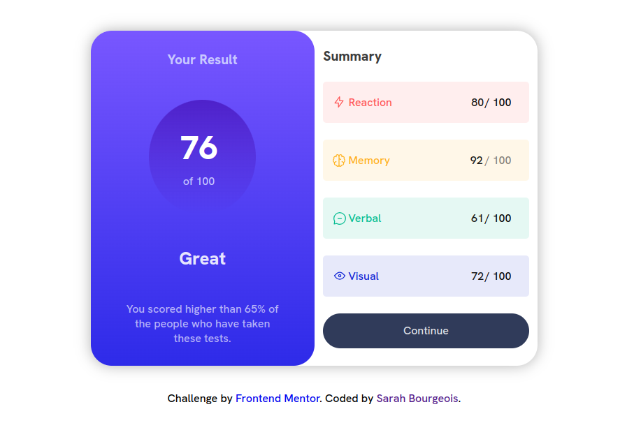
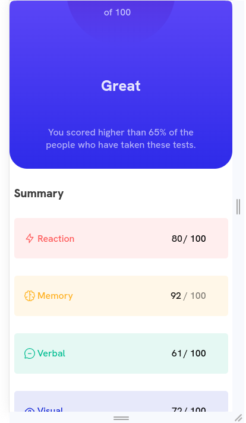

# RESULT SUMMARY COMPONENT MAIN 

This is a challenge completed using the [Frontend Mentor](https://www.frontendmentor.io?ref=challenge) website.

## Overview

  
  

## Link to the Solution

[solution](https://frolicking-sunshine-c5af51.netlify.app)

## Implementation

- Semantic HTML
- SASS 
- Responsive

## Author

My name is Sarah, I am 26 years old, and I am learning web development on my own.

[Link to my LinkedIn profile](https://www.linkedin.com/in/sarah-bourgeois-a4a098243/)

[Link to my Frontend Mentor profile](https://www.frontendmentor.io/profile/Sarah2511)
